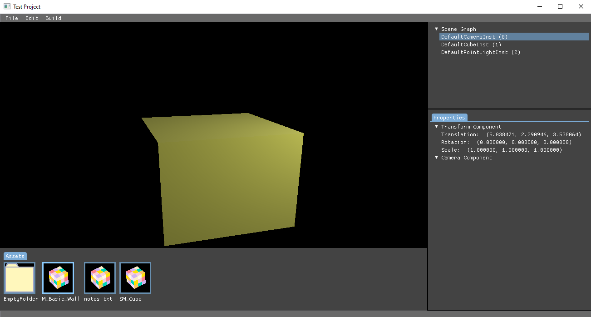

# Hedge engine and editor

Currently, the hedge engine and editor is a personal game engine or rendering framework for small projects.



## Prerequisite

This project relies on VulkanSDK, CMake, Ninja, python, WindowSDK and MSVC. Please have them ready before you continue on. One recommendation configuration is to install Visual studio for WindowsSDK and MSVC and intall others separately.

## How to build the editor

Execute the following cmake command under the `editor` folder.

```
xxxx\Hedge\editor> cmake -Bbuild -G "Visual Studio 16 2019" -S .
```

Please note that the edtior visual studio solution contains the engine project and you shouldn't build the engine separately for the editor.

## How to build the engine

```
xxxx\Hedge\engine> cmake -Bbuild -G "Visual Studio 16 2019" -S .
```

The engine solution would build three static libraries: `glfw3.lib`, `HedgeEngine.lib` and `yaml-cpp.lib`. If you want to output them into one folder, you can set the `HEDGE_LIB` environment variable to the folder gathering these static libraries. In addition, you also need to gather all header files in the engine source code. This can be done by using the `tools/GatherHeaderFiles.py` and executing the following command:

```
xxxx\Hedge\tools> python GatherHeaderFiles.py .....
```

## How to create a game project and build a game

If you are only interested in using the editor to make a game, you don't have to build the engine by yourself. There are prebuilt editor, necessary static libraries and headers released with this project.

The only configuration that you need is to fill the `HEDGE_LIB` environment variable with the directory containing these released files.