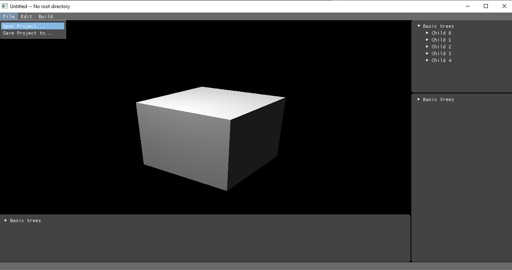
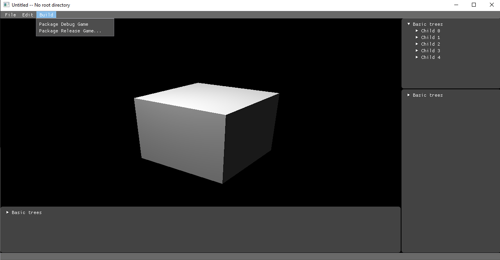

# Hedge building, linking, project organization

This design doc describes the design of the Hedge game engine project organization. This includes all relevant static libraries, dynamic libraries, relocatbale objects, executable objects and the generation of executable objects like the editor or a game.

## Introduction to relating basic components

* Engine: The Hedge game engine itself is a static library that contains code of the engine. This library is used by linking it into the game editor or the game application executable. It contains the entry point of the game executable and editor executable. The engine code itself has two modes: editor mode and game mode. When a developer builds the engine in the editor project, the engine would exclude the game template code. Otherwise, the engine library would include the game template symbols.

* Editor: The Hedge game engine editor is an executable. It has its own code that is separate from the engine's static library and needs to be linked to the engine library to build itself. The editor can be used to create a game project and package the game project into a game executable with assets. The editor can create two types of game. The first type is a debug mode game. This type of game is created in the same folder of the game project and it has a visual studio solution for the purpose of debugging the generated game. The second type is a release mode game, which is the final version that a player would play with.

* Game project: A game project contains all the assets and custom code that a game should have. These custom code will be compiled to relocatable objects and linked to the engine static libaray when the editor builds the game executable. The core of a game project is a `gameConfig.yml` file, which contains all the configuration information that a game project has.

* Game: A final game should be an executable with all relevant data. It is built from the game projects' custom code and the engine static library.

## Open and save a project

To open or save a project, you can click `Open Project...` or `Save Project to...` in the `File` dropdown shown below. When you click either of them, a dialog would pop up to let you select the yaml project file that you want to open or the folder that you want to save the current project.

## Game packaging and generation

To build release or debug mode of the game, you can click `Package Debug Game` or `Package Release Game..` in the `build` dropdown shown below. The `Package Debug Game` would build the game under the editor's current project root repository and the `Package Release Game..` would build the game under the repository that users choose in a pop up dialog.

Project and scene configuration files use the yaml format and they are not same. The project configuration yaml file wouldn't be copied to the final packaged game and the scene configuration file would be copied to the final packaged game for deserializing/serializing scene information into the RAM.

* NOTE: YAML's map is strictly same as the c++'s map concept, which can contain lots of entries instead of just one mapping. So, if the name of a configuration is a piece of useful information, then we need to use the map.

## Reference

1. Computer Systems A Programmer's Perspective 3rd Edition Section 7
2. [Hazel Game Engine Dev Log Videos](https://www.youtube.com/playlist?list=PLlrATfBNZ98dC-V-N3m0Go4deliWHPFwT)
3. [YAML CPP](https://github.com/jbeder/yaml-cpp)
4. [Windows dialog example](https://github.com/microsoft/Windows-classic-samples/blob/main/Samples/Win7Samples/winui/shell/appplatform/commonfiledialog/CommonFileDialogApp.cpp)